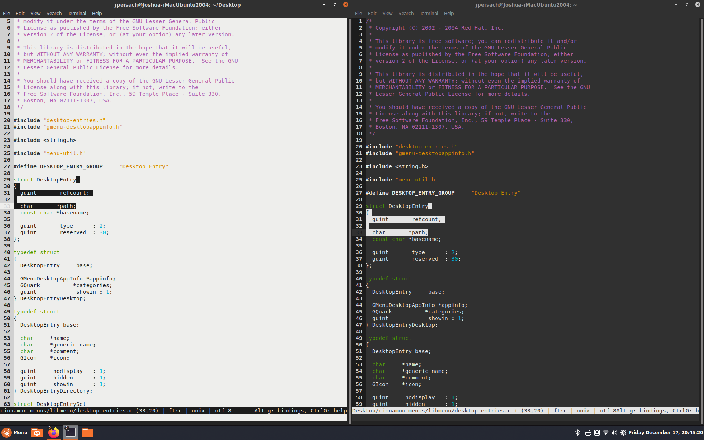

# Yaru Theme for [Micro](https://micro-editor.github.io/)

> micro is a terminal-based text editor that aims to be easy to use and intuitive, while also taking advantage of the capabilities of modern terminals. It comes as a single, batteries-included, static binary with no dependencies; you can download and use it right now!

> As its name indicates, micro aims to be somewhat of a successor to the nano editor by being easy to install and use. It strives to be enjoyable as a full-time editor for people who prefer to work in a terminal, or those who regularly edit files over SSH.

(https://github.com/zyedidia/micro/blob/master/README.md)

These are colorscheme files. They are installed to `~/.config/micro/colorschemes` and can be invoked as usual with `set colorscheme Yaru(-variant)`.

Originally translated from the [Yaru GtkSourceView files](https://github.com/ubuntu/yaru/tree/master/gtksourceview/src).

## Contributing
We look forward to your Pull Request! Please follow the [Ubuntu Code of Conduct](https://ubuntu.com/community/code-of-conduct) and abide by all copyright licenses.

## Copyright
Micro is licensed under the [MIT](https://github.com/zyedidia/micro/blob/master/LICENSE) license.

This theme is licensed under the [GNU General Public License v3.0 (or later)](https://github.com/ItzSwirlz/yaru-cli/blob/main/LICENSE). Credit should be given to [Martin Wimpress](https://github.com/flexiondotorg) for the original GtkSourceView files and [Joshua Peisach](https://github.com/ItzSwirlz) for Micro support.
